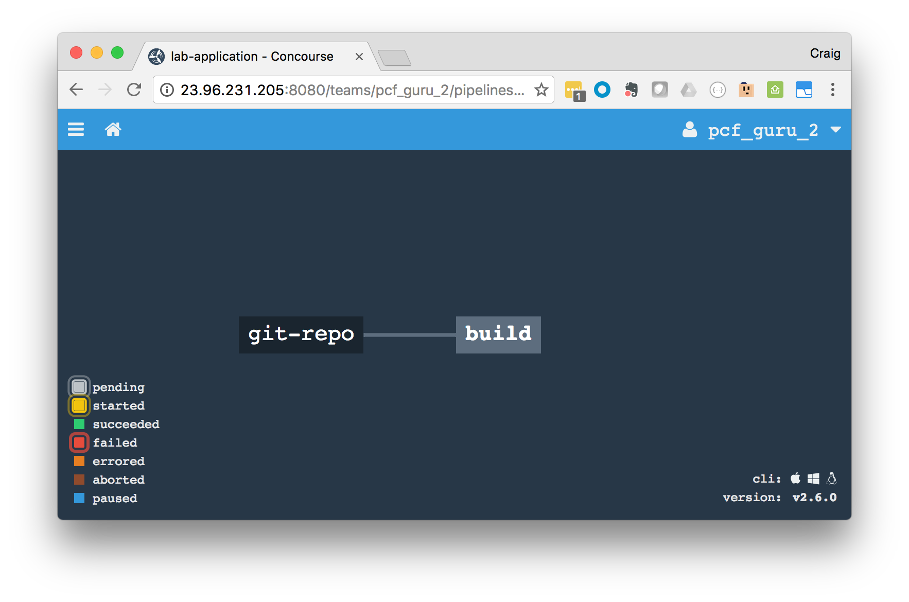
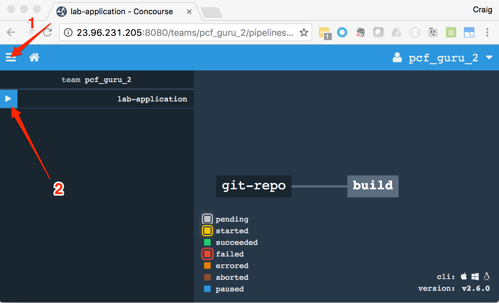
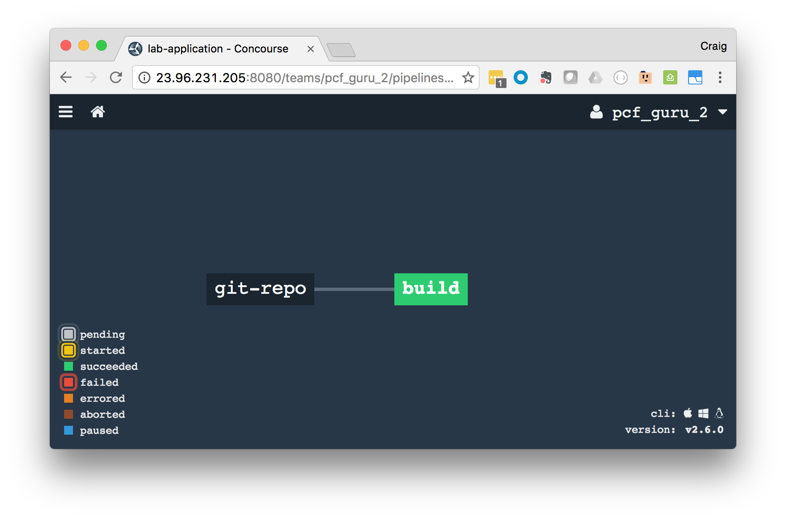

# Lab - Build your App with Concourse

## High Level Objectives
* Learn how to continuously build an application with Concourse

## Prerequisites
* Ensure you have a [Github](https://github.com) account
* Know the Concourse URI. It will be referenced in this lab as [Concourse URI]
* Know your Concourse team name. It will be referenced in this lab as [Concourse team]
* Know your Concourse username. It will be referenced in this lab as [Concourse username]
* Know your Concourse users password. It will be referenced in this lab as [Concourse password]

#### Steps

1. Download and install the *fly-cli*
  * In your browser, navigate to the [Concourse URI]. You should see something that looks like this:
    
  * Click on the appropriate operating system icon to download the *fly-cli* for your particular operating system
  * Install
1. In your browser, login to the Concourse web application. You will find *login* in the upper right hand corner of the screen.
  * Select your [Concourse team] form the list
  * Enter your [Concourse username] and [Concourse password]
  * Click on *login*
1. At your command line, login to the *fly-cli*

    ```
    fly -t ci login  -c [Concourse URI] -n [Concourse team]
    ```

    i.e.

    ```
    fly -t ci login  -c http://concourse.pcfonazure.com:8080 -n pcf_guru_1
    ```

    When prompted, supply the [Concourse username] and [Concourse password]

    We are telling the *fly-cli* to log us in, and set a target environment label (-t) as *ci*. In future commands, we will target this particular login by starting our commands with ```fly -t ci ...```
1. Create a [Concourse task](https://concourse.ci/running-tasks.html) for the build step
  * In the root directory of your *lab* application (we created in this in previous labs), create a ```ci``` directory
  * Under the ```ci``` directory, create two more directories: ```scripts``` and ```tasks```
  * Using your IDE or a command line editor, create a new file named ```build.yml``` in your ```lab/ci/tasks``` directory.
  * We want this task to execute in a container that has both the JDK and Gradle. We can define our *image_resource* with this [Docker image](https://hub.docker.com/r/brianbyers/concourse-gradle/)
  * We need to pull in our assets from the GitHub repo we just created, so we need to define that as an input
  * We will also need to output our artifact, so we need to define an output for this as well
  * To accomplish the above criteria, use your IDE or a command line editor to add the following to your ```lab/ci/tasks/build.yml``` file

    ```
    ---
    platform: linux

    image_resource:
      type: docker-image
      source:
        repository: brianbyers/concourse-gradle
        tag: "latest"

    inputs:
      - name: git-repo

    outputs:
      - name: artifact

    run:
      path: git-repo/ci/scripts/build.sh
    ```

1. Create a build script for your application
  * Using your IDE or a command line editor, create a new file named ```build.sh``` in your ```lab/ci/scripts``` directory. This script will be executed in a linux container; therefore, we do not provide an equivalent *.bat* file.
  * Enter the following text into the ```build.sh``` file:

    ```
    #!/usr/bin/env bash

    set -e
    export TERM=${TERM:-dumb}

    echo "=============================================="
    echo "Beginning build of Spring Boot application"
    echo "$(java -version)"
    echo "$(gradle -version)"
    echo "=============================================="

    cd git-repo

    ./gradlew clean build

    ARTIFACT=$(cd ./build/libs && ls latlong-retrieval*.jar)

    cp ./build/libs/$ARTIFACT ../artifact
    cp ./manifest.yml ../artifact

    echo "----------------------------------------------"
    echo "Build Complete"
    ls -lah ../artifact
    echo "----------------------------------------------"
    ```

    We are using the *gradlew* command we used earlier to clean and build our application. After that we are grabbing the name of the fat JAR (our build artifact) and copying it and the manifest to our artifact directory.
  * **Very Important:** If you are on a non-Windows environment, we need to set the bash script as executable, before we check it in. (I marked this as very important, because I forgot to do it while writing these steps). If you are using a Windows OS, we will cover this step later when we check our code in.
    * At the command line, in the ```lab/ci/scripts``` directory, execute:

      ```
      chmod +x build.sh
      ```

1. Start the pipeline with the build step
  * Using your IDE or a command line editor, create a new file named ```pipeline.yml``` in your ```lab/ci``` directory.
  * We will need to use the [git resource](https://github.com/concourse/git-resource) and create a job for the build
  * Add the following to the ```pipeline.yml``` file in ```lab/ci```:

    ```
    resources:
      - name: git-repo
        type: git
        source:
          uri: {{git-repo}}
          branch: {{git-repo-branch}}

    jobs:
      - name: build
        plan:
          - get: git-repo
            trigger: true
          - task: build
            file: git-repo/ci/tasks/build.yml
    ```

  * You will notice both *{{git-repo}}* and *{{git-repo-branch}}* are defined as placeholders. We will create an additional credentials file which will hold these values. This enables us to check the pipeline into source control.
  * We are using the *trigger: true* to tell Concourse to check for changes to the repo
1. Create a credential file
  * We do not want this file checked into source control. This first version will not contain any sensitive information, however it will eventually contain ssh keys, api keys, and passwords.
  * Create a file outside of your *lab* application root. We need to provide values for the placeholders in the above ```pipeline.yml```. Name this file: ```latlong-concourse-config.yml```
  * Add the following to ```latlong-concourse-config.yml```; making sure to replace the bracketed text with your repository's https URI:

    ```
    git-repo: [URI-OF-GITHUB-REPO]
    git-repo-branch: master
    ```

    it should look something like this:

    ```
    git-repo: https://github.com/cerdmann/lab-application.git
    git-repo-branch: master
    ```

1. Check in our files
  * Since Concourse will be pulling our tasks and scripts from the git-repo, we need to check everything in
  * At the root of your *lab* application, execute a ```git status``` to ensure our *concourse-config.yml* is not in the files that will be added. Move it to a higher directory if necessary.
  * Again, in the root of your *lab* application, execute the following commands to push your work:

    ```
    git add .
    ```

    On Windows, we need to ensure that the executable bit is flipped on a few of our files:
    ```
    git update-index --chmod=+x ci/scripts/build.sh
    git update-index --chmod=+x gradlew
    ```

    On either operating system, complete the following steps:

    ```
    git commit -m "Added build step to concourse pipeline."
    git push origin master
    ```

1. Push your pipeline to Concourse
  * At your command line, navigate to the root of your *lab* application. Use the fly command to push your app

    ```
    fly -t ci set-pipeline -p [name of the pipeline] -c [path to pipeline file] -l [path to credential file]
    ```

    i.e.

    ```
    fly -t ci set-pipeline -p latlong-retrieval -c ./ci/pipeline.yml -l ../concourse-config.yml
    ```

  * You will get prompted to *apply configuration*. Type *y*
1. View pipeline in browser
  * In your browser, refresh the page we logged into previously. You should see the following:

    

1. Run the pipeline
  * When you deploy a pipeline, it will be paused
  * Start by first clicking the hamburger menu in the upper left corner; second, click the play button next to the pipeline:

    

  * The initial pull could take a while as it grabs the Docker image
  * Once the *build* box starts blinking, click on it to check on progress
  * Examine the contents of the task steps, by clicking on *git-repo* and *build*
  * **Congratulations**, you've completed your first pipeline task

    
