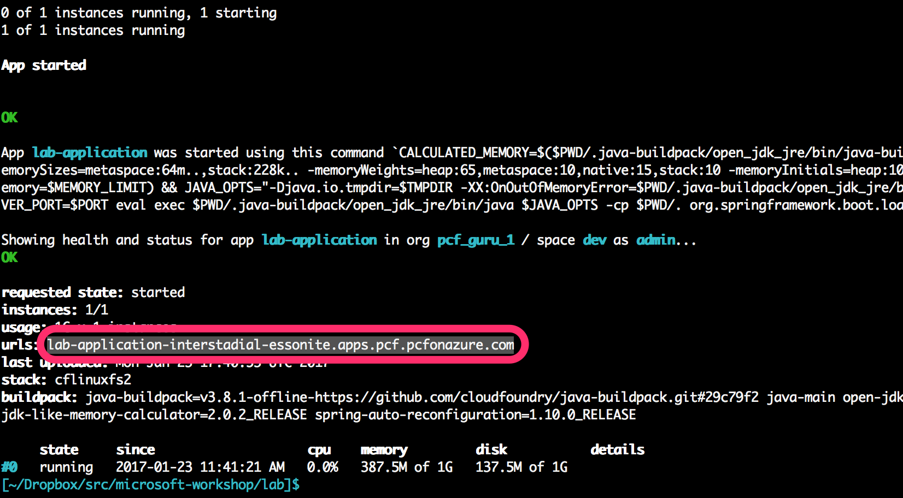

# Lab - Push Application to Pivotal Cloud Foundry

## High Level Objectives
* Learn how to deploy an application to Pivotal Cloud Foundry

## Prerequisites
* Ensure you have installed the [Cloud Foundry CLI](https://github.com/cloudfoundry/cli/releases)
* Know the *api* endpoint for the Pivotal Cloud Foundry you are targeting. It will typically look like this: ```https://api.sys.pcf.pcfonazure.com```, and will be referenced in this lab as [PCF-API endpoint]
* Know the Pivotal Cloud Foundry *Apps Manager* endpoint to view the status of your apps in your browser. It will typically look like this: ```https://apps.sys.pcf.pcfonazure.com```, and will be referenced in this lab as [PCF Apps Manager endpoint]
* Know your Pivotal Cloud Foundry username. It will be referenced in this lab as [PCF username]
* Know your Pivotal Cloud Foundry users password. It will be referenced in this lab as [PCF password]

#### Steps

1. In your terminal, set the PCF-API endpoint in the Cloud Foundry CLI

    ```
    cf api [PCF-API endpoint] --skip-ssl-validation
    ```

    i.e.

    ```
    cf api https://api.sys.pcf.pcfonazure.com --skip-ssl-validation
    ```

1. Login to Pivotal Cloud Foundry:

    ```
    cf login
    ```

    Follow the prompts to enter your [PCF username] and [PCF password]. When prompted for your space, select *dev*

1. Login to the Pivotal Cloud Foundry Apps Manager for a GUI view of your applications. In your browser, navigate to: [PCF Apps Manager endpoint]. Enter your [PCF username] and [PCF password] and explore the Apps Manager. Discover:
    * My Account
    * Quotas
    * Orgs and Spaces
    * Marketplace
    * Docs
    * Tools
    * Domain
    * Members
1. Jump back over to the terminal and push your app to Pivotal Cloud Foundry
    * In your terminal navigate to the root of your *latlong-retrieval* application that you setup
    * Package your application with ```./gradlew clean build```
    * There will be a fat JAR file (a single artifact with bundled dependencies) in the ```./build/libs``` directory.
    * Execute the push:

      ```
      cf push latlong-retrieval --random-route -i 1 -p ./build/libs/latlong-retrieval-0.0.1-SNAPSHOT.jar
      ```

      Note: execute ```cf push --help``` with no parameters to see what the parameters for cf push mean. Also, we are using the ```--random-route``` parameter. Pivotal Cloud Foundry will create a route for your app based on the domain of the org and the application name. If you are executing this lab in a classroom with other students, then the first student to execute the push will claim the route and everyone else will error out. Random route ensures each student will have a unique route for their app.
1. Test drive your new app
    * Get the route to your app from the output of the ```cf push```:
      
    * Enter the route in your browser followed by the path of ```/byzip/12345```. You should see the same result that you saw locally
    * Think about the things that you didn't have to do:
      * You didn't provision a VM
      * You didn't install an application runtime
      * You didn't deploy an application to a VM or container
      * You didn't configure a load balancer
      * You didn't configure ssl termination
      * You didn't configure a firewall
1. Test drive some other *cf* commands
    * ```cf app latlong-retrieval```
    * ```cf scale latlong-retrieval -i 2```

      The *scale* command scales your application to 2 instances. In addition to the tasks above that you didn't have to worry about, you also didn't have to reconfigure your load balancer and update routes
    * ```cf events latlong-retrieval```
    * ```cf logs latlong-retrieval --recent```
    * ```cf restart latlong-retrieval```
    * ```cf restage latlong-retrieval```
1. View your app in the Apps Manager
    * Switch to your browser and refresh the Apps Manager. You should see your application in the dev space. You will notice that many of the options available to you on the command line are available in the gui. Discover:
      * Routes
      * Logs
      * Settings
      * Scaling
      * Environment Variables
      * Settings
      * Metrics via PCF Metrics (link found in the *Overview* pane)
1. Create a manifest for your application
    * We create manifests to capture the parameters of ```cf push```. We can have different manifests depending on the environment to which we are pushing, or use it to simplify what we have to enter on the command line
    * In your terminal or IDE create a file at the root of the *lab* application named ```manifest.yml```
    * Add the following contents to the file:

      ```
      ---
      applications:
      - name: latlong-retrieval
        random-route: true
        memory: 512M
        disk: 1G
        instances: 2
        path: ./build/libs/latlong-retrieval-0.0.1-SNAPSHOT.jar
      ```

    * At your command line, make sure you are in the root of the *lab* application, and execute ```cf push```. Note that *cf* found the manifest file and didn't require any command line parameters
